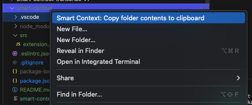

# Smart Context: Local, Open-Source Code Context Solution

Quickly copy entire folders to your clipboard, respecting .gitignore, for use in ChatGPT or other AI apps as context.

**Smart Context** is an open-source VS Code extension that gives you full control over how you manage and copy text from your projects—without ever leaving your local environment. It respects `.gitignore` and keeps your **private code secure**, unlike cloud-dependent alternatives like uithub.com.

## Why Smart Context?

- **100% Open-Source**: Modify and extend it to fit your needs. It's your tool, fully under your control.
- **Private and Secure**: Works locally on your machine, ensuring that sensitive or proprietary code stays private—no external APIs involved.
- **Respects `.gitignore`**: Automatically excludes files and folders specified in `.gitignore`, making it ideal for large projects.

## Key Features

- **Copy Text Files Easily**: Grab contents from all text files in a selected folder and paste them wherever you need.
- **Support for Multiple Extensions**: Recognizes a wide range of file extensions, ensuring that all your relevant text data is included.
- **Seamless Workflow**: No complex setup or configuration—just right-click, copy, and paste.

## How to Use

1. **Right-Click**: Right-click on any folder in the VS Code file explorer.
2. **Select Command**: Choose **"Smart Context: Copy Folder Contents to Clipboard"**.
3. **Paste**: Paste the concatenated file contents, including relative paths, wherever needed.

Alternatively:
- Open the Command Palette (Ctrl+Shift+P or Cmd+Shift+P).
- Select "Smart Context: Copy Folder Contents to Clipboard".
- Choose your folder.

## Why Choose Smart Context Over uithub.com?

- **Complete Privacy**: Unlike uithub.com, Smart Context operates entirely on your machine, ensuring no code leaves your environment.
- **Open-Source Freedom**: Customize the tool as you see fit—no locked-down features or hidden limitations.
- **.gitignore Compliance**: Automatically exclude files you don't need, streamlining your workflow.

## Installation

### From GitHub
1. **Download**: Get the latest `.vsix` file from our [GitHub Releases](./releases).
2. **Install**: 
   - Drag the `.vsix` into the VS Code Extensions view, or
   - Open the Extensions view, click the "..." menu, select "Install from VSIX...", and choose the file.

## License

This project is licensed under the MIT License. See the [LICENSE](./MIT_LICENSE) file for details.

## Author

🌴 Brian
